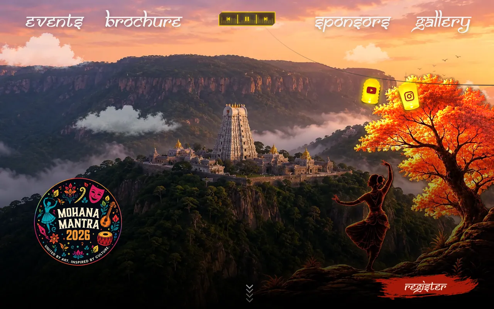
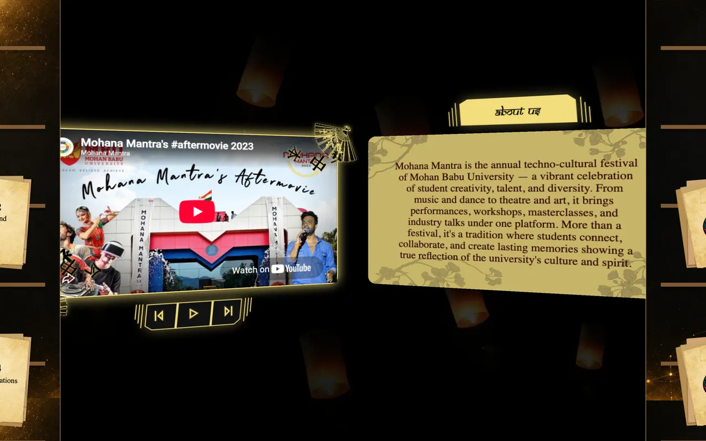
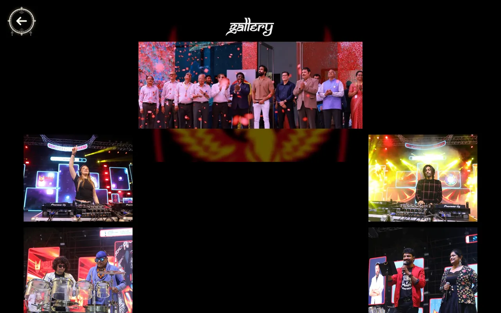
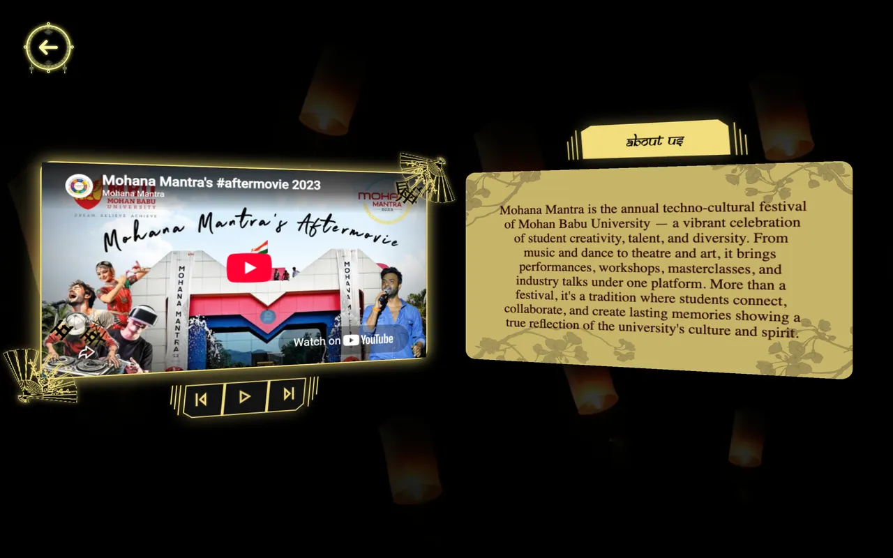
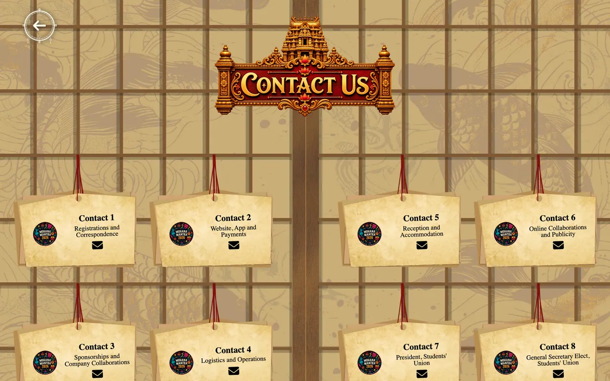
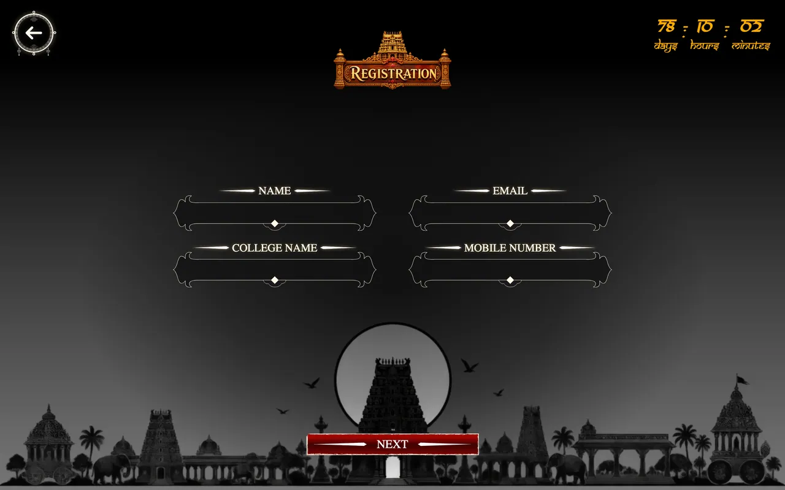

# MohanaMantra 2K26


**United By Art. Inspired By Culture.**

The official website for MohanaMantra 2K26, the annual cultural festival at MBU.

[**mm-template.vercel.app**](https://mm-template.vercel.app)

---

## Screenshots

### Landing

The hero sits over the Tirumala hills sketch, with the navbar, the music player and
the lantern social links strung from the tree.





### Events


### Gallery



### About & Contact





### Registration



---

## Tech stack

| Area | Choice |
| --- | --- |
| Framework | React 19 + TypeScript 5.8 |
| Build | Vite 7 |
| Styling | SCSS modules |
| Animation | GSAP 3 (+ ScrollTrigger), Framer Motion 12 |
| Smooth scroll | Lenis |
| State | Zustand 5 |
| Routing | React Router 7 |
| Forms | React Hook Form + Yup |
| HTTP | Axios |
| Auth | Google OAuth (`@react-oauth/google`) |
| Analytics | React GA4 |
| SEO | React Helmet |

---

## Getting started

Requires **Node 20 or newer** (CI builds on 20).

```bash
git clone https://github.com/sameerreddy789/MM_template.git
cd MM_template
npm ci
npm run dev
```

The dev server prints its own URL — usually <http://localhost:5173>, or the next
free port if that one is taken.

### Scripts

| Script | Does |
| --- | --- |
| `npm run dev` | Vite dev server with HMR, exposed on the local network |
| `npm run build` | Typechecks with `tsc -b`, then builds to `dist/` |
| `npm run preview` | Serves the built `dist/` locally |
| `npm run lint` | ESLint across the project |

`npm run build` runs the typechecker first and **fails the whole build on any TypeScript
error**, including unused variables. Worth running before you push.

---

## Project structure

```text
public/            Static assets copied verbatim into the build
  images/          Photography and UI art (WebP)
  svgs/            Vector art
  sounds/          Background music tracks
  videos/          Gallery video and ink-transition frames
src/
  App.tsx          Page switching, door transitions, asset preloading
  Homepage.tsx     Landing route wrapper
  assetList.ts     Per-page asset manifest used by the preloader
  utils/store.ts   All Zustand stores (overlay, ham, music, nav visibility)
  pages/
    landingRevamp/ Hero, music player, social links
    events/        Event categories and listings
    gallery/       Image and video grid with lightbox
    registration/  Multi-step registration form
    aboutus/  contact/  brochure/  sponsers/  mediaPartners/  comingSoon/
    components/    Shared: navbar, preloaders, door transition, background music
docs/screenshots/  Images used by this README
```

---

## Architecture notes

A few things that are non-obvious from the file tree:

**Routing is hand-rolled.** `App.tsx` does not use a `<Routes>` tree. It derives a
`currentPage` string from `location.pathname` and conditionally renders each page as a
sibling. Anything that needs to survive navigation therefore has to be mounted *above*
that conditional block, not inside a page.

**Background music is global.** `components/backgroundMusic/BackgroundMusic.tsx` owns the
only `<audio>` element in the app and is mounted once in `App.tsx` so playback continues
across pages. It is suppressed on the gallery, which autoplays a video of its own. The
transport controls live in `LandingRevamp` and reach the element through `useMusicStore`.
Spacebar toggles playback anywhere except the gallery.

**Two preloaders.** The landing page uses `DrawingPreloader`, which measures each SVG
path and reveals it with a `strokeDashoffset` tween in step with asset loading, gated
behind an Enter click. Every other route uses the lighter `registration/components/Preloader`,
which advances by itself once its assets resolve.

**Door transitions.** Navigation goes through `goToPage()`, which closes the doors,
preloads the target page's assets from `assetList.ts`, then navigates — so route changes
are deferred behind the animation rather than racing it.

**Assets are WebP.** Images are capped at 1920px on the longest edge and encoded as WebP
(quality 80 for photography, 88 for flat UI art with transparency). Keep new artwork to
the same budget; a few oversized PNGs previously accounted for the bulk of page weight.

---

## Deployment

Two paths are configured:

- **Vercel** — `vercel.json` sets long-lived immutable cache headers for `/videos/*` and
  rewrites all routes to `index.html` for client-side routing.
- **GitHub Actions** — `.github/workflows/deploy.yml` builds on push to `prod` and copies
  `dist/` to the server over `scp`.

---

## Contributors

- **Monish Reddy**
- Vedium Sameer Reddy
- chaitanya03456

---

## 🛡️ Security Audit Report

A comprehensive vulnerability assessment was performed against the live production deployment using **RapidScan v1.2** (Kali Linux multi-tool security engine).

### 📊 Scan Performance & Metrics

- **Target URL:** `https://mm-template.vercel.app/`
- **Audit Date:** August 12, 2026
- **Total Scan Duration:** `1h 40m 03s` (1 hour, 40 minutes, 3 seconds)
- **Total Vulnerability Checks Evaluated:** **80** checks
- **Security Tools Deployed:** `Nmap`, `Nikto`, `SSLyze`, `Wafw00f`, `Uniscan`, `WhatWeb`, `Wapiti`, `TheHarvester`, `Fierce`, `AMass`
- **Result:** **PASSED (Clean Infrastructure)**

### 🔍 Key Findings & Security Summary

- **Network Isolation:** Only standard web ports (`80/HTTP` and `443/HTTPS`) are accessible. No database (MySQL, PostgreSQL, MSSQL, Oracle) or administrative ports (RDP, SMB, FTP, Telnet) are exposed.
- **SSL/TLS Security:** Fully patched against Heartbleed, POODLE, FREAK, and CCS Injection attacks.
- **DoS / Slowloris Resilience:** Passed. Server connections time out cleanly against slow HTTP header attacks.
- **Application Vulnerabilities:** Zero LFI (Local File Inclusion), RFI (Remote File Inclusion), RCE (Remote Code Execution), or SQL Injection vulnerabilities detected.
- **CMS Security:** No legacy CMS backdoors or plugin vulnerabilities present.

---
